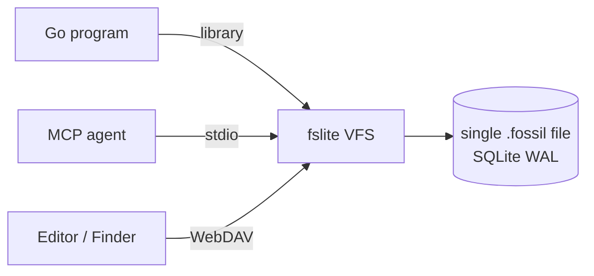

# fslite

A single-file content-addressed filesystem for autonomous agents.

Backed by [Fossil](https://fossil-scm.org/) — one `.fossil` file (SQLite, compressed) holds every version of every file. Surfaced as a [Model Context Protocol](https://modelcontextprotocol.io) server so any MCP-speaking agent gets a worktree-like API with full history — without touching your git checkout.

## Why

When an agent edits files, it edits *your* working tree. Files change under you. Commits land in your branch. Experiments leave debris in `git status`.

fslite gives each agent its own worktree, isolated from your real filesystem. Files live compressed inside a single `.fossil` file and decompress on demand — no checkout dir, no temp dance, no kernel mount required. Every write is timeline-tracked, every commit is reachable, every file has full history.

You can inspect the resulting repo any time with `fossil ui mybox.fossil`, merge it into your real codebase, or throw it away.

## Install

```sh
npm install -g @agent-ops/fslite
```

(The CLI command is still `fslite`; npm scope is namespace only.)

Or build from source:

```sh
git clone https://github.com/danmestas/fslite
cd fslite
make build      # → ./fslite
```

## Use with any MCP agent

Add to your agent's MCP config:

```json
{
  "mcpServers": {
    "fslite": {
      "command": "fslite",
      "args": ["mcp", "--repo", "~/agent-workspaces/mybox.fossil"]
    }
  }
}
```

The agent now has these tools:

| Tool | What it does |
|---|---|
| `list(path)` | directory listing |
| `read(path)` | file contents (text or base64) |
| `write(path, content)` | create/overwrite |
| `stat(path)` | metadata |
| `delete(path)` | remove |
| `rename(from, to)` | move |
| `mkdir(path)` | advisory (dirs materialise on first write) |
| `commit(message)` | drain overlay → new Fossil check-in |
| `ignore_get` / `ignore_set` | manage the sentinel-file filter |

Writes accumulate in an overlay until `commit`, so a task's worth of edits lands as one logical check-in instead of one per write. The overlay is durable — it lives in the same `.fossil` file and survives a restart — but it isn't history: `fossil timeline` and `fossil ls` don't see those writes until something commits them.

## Use as a CLI

```sh
fslite demo                       # ephemeral seeded repo in a temp dir, auto-mounted
fslite open path/to/any.fossil    # or serve a specific repo (created if missing)
# ...edit in TextEdit, VS Code, vim, whatever...
fslite commit "what I changed"
fslite unmount
fslite stop
```

Both pick a free port and mount in Finder on macOS (`--no-mount` to skip). `demo` throws its repo away on exit; `open` persists — Ctrl-C only stops the daemon and unmounts. Pass `--auto-commit=10s` to either for debounced commits instead of explicit `fslite commit`.

For multi-agent setups, give each daemon its own port + repo:

```sh
fslite serve --repo ~/work/proj-a.fossil --http 127.0.0.1:8080
fslite serve --repo ~/work/proj-b.fossil --http 127.0.0.1:8081

fslite list                       # table of every running daemon
fslite mount --agent proj-a       # mount a specific one
fslite stop --all                 # reap everything
```

Agents auto-name from the repo filename (`proj-a.fossil` → `proj-a`), deconflict with `-2`/`-3` suffixes, or `--random-name` for `electric-hyena-a3f` style.

## Use from Go

```go
import "github.com/danmestas/fslite/vfs"

v, _ := vfs.New(vfs.Config{
    RepoPath:     "/path/to/mybox.fossil",
    EnableWrites: true,
    NoNATS:       true,
})
defer v.Close()

content, _ := fs.ReadFile(v, "src/main.go")

f, _ := v.OpenFile("notes.md", os.O_WRONLY|os.O_CREATE, 0644)
f.(io.Writer).Write([]byte("hello"))
f.Close()

v.Commit("docs: add note")
```

The VFS implements `fs.FS`, `fs.ReadDirFS`, `fs.StatFS` — usable as a drop-in for anything that takes `io/fs`.

## How it works



- One SQLite file (the fossil repo) holds every version of every file, **compressed at rest** (deflate + delta chains).
- The VFS reads tree metadata from the checkin's manifest; file content stays compressed until something reads it.
- On `read`, libfossil walks the delta chain and decompresses on demand. Content lives only for the lifetime of the file handle; it's not paged to disk.
- Writes accumulate in an overlay (another SQLite table in the same file). `commit` drains them into a new Fossil check-in and clears the overlay.
- The whole filesystem is one portable file. Move it, sync it, attach it to another machine — your workspace travels.
- Optional NATS-mediated autosync makes multiple peers converge on the same project code in ~0.5s. Optional cross-agent WebDAV locks coordinate file ownership when humans and agents share a mount.

## Cross-platform

macOS, Linux, Windows native. Cross-compiles to `wasip1` and `js`. macOS gets a Finder mount via WebDAV (`fslite mount`); other platforms use the MCP server or the Go library.

## License

[MIT](LICENSE). Contributions welcome — see [CONTRIBUTING.md](CONTRIBUTING.md).
