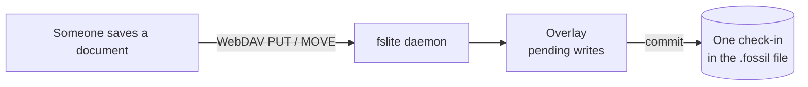

# fslite

Mount a [Fossil](https://fossil-scm.org/) repository as an ordinary folder. People who have never heard of version control open it, edit documents, and save — and every save lands as a real Fossil check-in.

One `.fossil` file (SQLite, compressed) holds every version of every file. fslite serves it over WebDAV, so Finder, Windows Explorer or a Linux `davfs2` mount can treat it like any other network folder. Nothing is checked out to disk: no working copy to go stale, no `fossil add` to forget, no kernel extension.

## Why

Fossil is a fine place to keep contracts, handbooks, meeting notes and drawings — it's a single file, it has full history, and it comes with a web UI. What it doesn't have is a way to hand that repository to a colleague who is never going to run `fossil commit`.

fslite is that way. You mount the repo; they see a folder.

## Quick start

```sh
npm install -g @agent-ops/fslite     # or: git clone … && make build
```

```sh
fslite demo                                  # throwaway repo, mounted, cleaned up on exit
fslite open ~/Documents/contracts.fossil     # serve a real repo (created if missing)
```

On macOS the volume appears at `/Volumes/contracts.localhost` and opens in Finder. Edit files, then:

```sh
fslite commit "Q3 contracts from legal"      # drain pending writes into one check-in
fslite unmount && fslite stop
```

Or let it commit for you — `--auto-commit=10s` turns ten quiet seconds after the last write into a check-in with a generated message.

Verify with ordinary Fossil tooling, no fslite involved:

```sh
fossil timeline -R ~/Documents/contracts.fossil
fossil ui -R ~/Documents/contracts.fossil
```

### Linux

There's no `fslite mount` on Linux; use `davfs2` against the same URL.

```sh
sudo apt install davfs2
echo 'ask_auth 0' | sudo tee -a /etc/davfs2/davfs2.conf
sudo mount -t davfs http://127.0.0.1:8080 /mnt/contracts
```

### Sharing beyond one machine

`fslite open` binds to loopback on purpose: **there is no authentication in front of the WebDAV endpoint.** Anything that can reach the port can rewrite the repository. To reach it from elsewhere, tunnel over SSH, or bind wider (`fslite serve --http 0.0.0.0:8080`) only behind a reverse proxy that authenticates.

## What actually happens on save



Writes accumulate in an overlay until a commit, so an afternoon of edits becomes one meaningful check-in instead of forty. The overlay is durable — it lives in the same `.fossil` file and survives restarting the daemon — but it isn't history: `fossil timeline` and `fossil ls` don't show those writes until something commits them.

Editor save patterns are handled, including the write-a-temp-file-then-rename dance that Word, TextEdit and most Linux editors perform. Finder and Windows droppings (`.DS_Store`, `._*`, `Thumbs.db`, editor swap and backup files) are filtered out of check-ins by default; `fslite ignore` shows or changes the list.

## Commands

| Command | What it does |
|---|---|
| `fslite open <repo>` | Serve a repo and mount it (macOS). Creates it if missing. |
| `fslite demo` | Throwaway seeded repo in a temp dir; deleted on exit. |
| `fslite serve` | Daemon only. Flags or `REPO_PATH` / `HTTP_ADDR` / `AGENT_ID` / `FSLITE_AUTO_COMMIT`. |
| `fslite mount` / `unmount` | Mount or unmount a running daemon's volume (macOS). |
| `fslite commit "msg"` | Drain the overlay into a check-in. |
| `fslite status` / `list` | What's running: agent, repo, URL, mountpoint. |
| `fslite ignore` | Read or set which files never reach a commit. |
| `fslite stop` | Stop the daemon; `--all` reaps every one. |

## Platform support

| | Status |
|---|---|
| macOS — Finder mount | Verified end to end |
| Linux — `davfs2` mount | Verified in CI on x86-64, and on arm64 |
| Windows — daemon and WebDAV protocol | Verified in CI |
| Windows — Explorer *Map network drive* | Not verified; the protocol behind it is |

Builds for macOS, Linux and Windows, and cross-compiles to `wasip1` and `js`.

## For AI agents

The same VFS is exposed as a [Model Context Protocol](https://modelcontextprotocol.io) server, which gives an agent a worktree with full history without touching your git checkout:

```json
{
  "mcpServers": {
    "fslite": {
      "command": "fslite",
      "args": ["mcp", "--repo", "~/agent-workspaces/mybox.fossil"]
    }
  }
}
```

Tools: `list`, `read`, `write`, `stat`, `delete`, `rename`, `mkdir`, `commit`, `ignore_get` / `ignore_set`.

## Use from Go

```go
import "github.com/danmestas/fslite/vfs"

v, _ := vfs.New(vfs.Config{RepoPath: "/path/to/mybox.fossil", EnableWrites: true, NoNATS: true})
defer v.Close()

content, _ := fs.ReadFile(v, "src/main.go")
v.Commit("docs: add note")
```

The VFS implements `fs.FS`, `fs.ReadDirFS` and `fs.StatFS`, so it drops into anything that takes `io/fs`.

## How it works

- One SQLite file (the Fossil repo) holds every version of every file, **compressed at rest** (deflate + delta chains).
- The VFS reads tree metadata from the check-in's manifest; content stays compressed until something reads it.
- On read, libfossil walks the delta chain and decompresses on demand. Content lives only for the lifetime of the file handle; it is never paged to disk.
- Writes accumulate in an overlay table in the same file. `commit` drains them into a new check-in and clears the overlay.
- The whole filesystem is one portable file. Move it, sync it, attach it to another machine.
- Optional NATS-mediated autosync converges multiple peers on the same project code in ~0.5s, with cross-agent WebDAV locks when people and agents share a mount.

## Changelog

See [CHANGELOG.md](CHANGELOG.md).

## License

[MIT](LICENSE). Contributions welcome — see [CONTRIBUTING.md](CONTRIBUTING.md).
