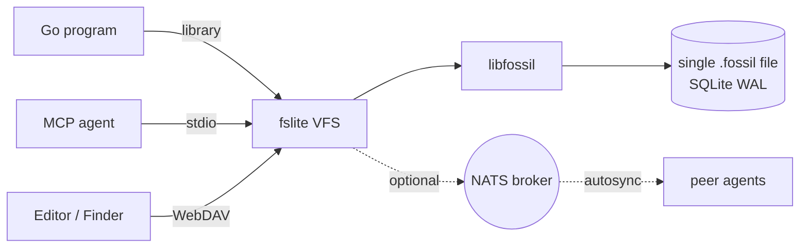

# Fossil-VFS: a portable, lazy-on-demand virtual filesystem for Fossil repositories

**Status:** active design. Supersedes `2026-03-25-fslite-design.md`,
`2026-03-26-fskit-design.md`, and `2026-03-27-fslite-reimplementation-design.md`.

**Date:** 2026-05-22

## 1. Pivot statement

The previous two iterations of this repo targeted kernel-level filesystem
integration on macOS — first via `go-fuse` (kext requirement, hard-blocked),
then via Apple FSKit (`fskitd` rejects mounts from non-platform binaries,
hard-blocked on codesigning).

This iteration drops kernel integration entirely. Fossil-VFS is a pure
userspace virtual filesystem: a Go `io/fs.FS` for in-process agent use and
a WebDAV server for editor / Finder access. No kernel module, no system
extension, no platform-signed entitlements.

Both humans (via WebDAV mount) and autonomous coding agents (via in-process
`io/fs.FS`) are first-class consumers. Both read this spec.

## 2. Goals

- Expose any Fossil repository as `io/fs.FS` — `ReadDir`, `Stat`, `Open`
  derived from a check-in's manifest without disk checkout.
- Lazy materialisation: file content stays in Fossil's SQLite blob store
  until first `Open` / first read.
- Per-agent worktree isolation: each agent owns a dedicated Fossil
  repo file; convergence is via Fossil's native autosync, coordinated
  through NATS commit-notifications.
- Optional WebDAV adapter (`golang.org/x/net/webdav`) for editor/Finder
  access on macOS, Windows, Linux, iOS, Android.
- Runs unchanged under WASI / WasmEdge / Cloudflare Workers. Libfossil
  is portable C and compiles cleanly to WASM; the whole stack is Go +
  CGo-to-WASM.
- ACID inherited from SQLite's WAL: no separate journaling layer for the
  VFS overlay.

## 3. Non-goals

- Full POSIX semantics. No `inotify`, no hardlinks, no fifos, no devices.
  Symlinks: see §9.
- Kernel-fast read throughput. Trading raw bandwidth for portability is
  the explicit deal.
- Replacement for the `fossil` CLI. The VFS complements it; checkouts,
  bisect, ticket UI, etc. remain CLI-driven.
- GUI. Callers layer one if they want.
- Built-in conflict resolution UX. Fossil's merge/diff tooling is what
  agents and humans use when autosync surfaces a conflict (see §5.3).

## 4. Architecture



Three integration shapes share one core:

1. **Library** — Go programs import `vfs` and use a `*VFS` directly.
2. **MCP server** — agent runtimes spawn `fslite mcp` over stdio and
   use its tools (any client that speaks the Model Context Protocol).
3. **WebDAV server** — `fslite serve` exposes the same VFS over HTTP
   so editors and Finder can mount it.

All three sit on top of the **VFS core**, which holds the manifest
cache + the SQLite overlay. The core delegates to the **engine** (a
libfossil bridge), which speaks to a per-agent fossil repo file
(SQLite WAL). Multiple cores against the same repo serialise on
SQLite's writer lock.

Cross-agent sync (optional) layers on top: each VFS publishes a
commit notification on a NATS subject, peers receive it and pull
via a NATS-mediated xfer transport. JetStream KV holds the WebDAV
LockSystem so locks are visible across agents.

### 4.1 Components

| Component | Role |
|---|---|
| **Manifest cache** | In-memory tree derived once per check-in from `manifest` blob. Indexed by path for `ReadDir` / `Stat` in O(log n). |
| **Blob cache** | LRU of decompressed file content, sized in bytes. Read-through to libfossil on miss. |
| **Overlay** | Uncommitted writes. Lives **in the agent's own Fossil repo as workspace state** (see §5.2) — not a separate in-memory map. SQLite handles durability and concurrency. |
| **libfossil bridge** | CGo-bound calls for `repo_open`, `manifest_for_checkin`, `blob_for_hash`, `commit`, `sync`. Pure-Go fallback (manifest parse + `modernc.org/sqlite` blob read) is permitted but secondary; libfossil is the reference path. |
| **WebDAV adapter** | Thin wrapper exposing `webdav.FileSystem` over `FossilVFS`. Binds `127.0.0.1:$port` by default. |
| **Sync hook** | On `Commit()`, publishes a commit notification on the project's NATS subject. On notification receipt, runs `fossil pull` against the announced peer. |

## 5. Isolation, sync, and consistency

This is the load-bearing section. Read it twice.

### 5.1 Per-agent repository

Each agent owns a dedicated SQLite Fossil repo on disk (or in memory under
WASM). The path layout follows the `sesh` precedent:

```
<workspace-root>/.fossil-vfs/agents/<agent-id>/repo.fossil
```

The agent's `FossilVFS` instance opens *that* file exclusively. SQLite WAL
gives single-writer-multiple-reader durability; no second process touches
the file. Crash safety is whatever SQLite gives us — which is "ACID with
WAL" — and that is sufficient. The spec does not add a second journaling
layer.

### 5.2 Overlay is uncommitted Fossil state, not RAM

The original draft called for a separate in-memory overlay. Reworked:
writes go to the agent's repo as **uncommitted workspace deltas** stored
in a Fossil-native staging area (or, if libfossil exposes nothing
suitable, a single SQLite table inside the agent's repo file —
`workspace_overlay(path BLOB PRIMARY KEY, content BLOB, mtime INTEGER,
mode INTEGER, deleted INTEGER)`).

Reads check the overlay table first, fall through to the manifest cache,
fall through to libfossil blob extraction. Cache lookups never cross the
overlay boundary.

`Commit(message string)` drains the overlay table into a new Fossil
check-in via libfossil, then truncates the overlay table inside the same
SQLite transaction.

### 5.3 Autosync: pull before push

Coordination between agents (and between agents and humans) is **eventual
consistency via Fossil's native sync**, surfaced over NATS for low-latency
notification — the standard "pull-before-push" Fossil sync pattern.

1. Agent calls `Commit(msg)`.
2. Local `fossil commit` writes a new check-in in the agent's repo.
3. VFS publishes `{repo: $project_code, agent: $id, ckin: $hash}` on
   subject `fossil-vfs.<project-code>.commit`.
4. Peer VFS instances subscribed to that subject receive the
   notification and run `fossil pull` (via libfossil's xfer protocol)
   against an announced HTTP endpoint.
5. **Before any future `Commit` from this agent**, the agent's VFS does
   `Sync(Pull: true)` automatically: pull first, attempt push. If push
   fails because the remote moved, the local commit lands on an auto-named
   private branch (`agent-<id>-<short-hash>`); the merge back to trunk is
   surfaced to the agent as a `MergeRequired` error from `Commit`.
6. Convergence target: ~0.5s under normal load. No synchronous distributed
   transactions.

### 5.4 Conflict policy

The VFS does not attempt automatic three-way merges. On conflict at push
time, the agent receives `ErrMergeRequired` with the local branch name
and the conflicting remote check-in hash. The agent's policy module — not
this VFS — decides whether to merge, abandon, or escalate. Humans use
`fossil merge` and `fossil ui` against the affected repo file directly.

## 6. Core Go API

```go
// Config opens a Fossil-VFS instance backed by a per-agent repo file.
type Config struct {
    RepoPath     string // path to .fossil-vfs/agents/<id>/repo.fossil
    Checkin      string // commit hash, branch name, tag, or "trunk"
    AgentID      string // identity emitted on NATS + used as branch suffix
    ProjectCode  string // shared identifier across peer repos
    NATSConn     *nats.Conn // optional; nil = no autosync
    CacheBytes   int64   // blob cache target size; 0 = 64 MiB default
    EnableWrites bool
}

type FossilVFS struct { /* unexported */ }

func New(cfg Config) (*FossilVFS, error)

// FS returns an io/fs.FS view rooted at the configured check-in.
// Implements ReadDirFS, StatFS, and (when EnableWrites) writable open.
func (v *FossilVFS) FS() fs.FS

// SwitchCheckin re-roots the FS at a different check-in. Invalidates
// the manifest cache; blob cache survives (content-addressed).
func (v *FossilVFS) SwitchCheckin(name string) error

// Commit drains the overlay into a new Fossil check-in.
// Returns ErrMergeRequired if the agent must merge before committing.
func (v *FossilVFS) Commit(message string) (CheckinID, error)

// Sync runs pull (and optionally push) against the autosync peer.
// Called automatically before Commit; exposed for explicit use.
func (v *FossilVFS) Sync(opts SyncOptions) error

// ServeWebDAV starts the WebDAV adapter on the given address.
// Blocking. Returns on shutdown signal or unrecoverable error.
func (v *FossilVFS) ServeWebDAV(addr string) error

func (v *FossilVFS) Close() error
```

Implements `fs.FS`, `fs.ReadDirFS`, `fs.StatFS`, `webdav.FileSystem`.

### 6.1 Errors

```go
var (
    ErrMergeRequired  = errors.New("local diverged from peer; merge required")
    ErrReadOnly       = errors.New("vfs opened without EnableWrites")
    ErrCheckinUnknown = errors.New("no such check-in")
)
```

## 7. WebDAV adapter

- Binds `127.0.0.1:$port`. Cross-host binding requires an explicit
  `WebDAVConfig.AllowRemote = true` to make the security tradeoff
  conscious.
- Supports `OPTIONS`, `PROPFIND`, `GET`, `PUT`, `MKCOL`, `DELETE`,
  `MOVE`, `COPY`, `LOCK`, `UNLOCK`. `LOCK` is advisory only —
  enforcement is the editor's job.
- Authentication: optional bearer token in `Authorization` header.
  Default off when bound to loopback.
- Large file streaming: `GET` uses `io.ReaderAt` from the blob cache;
  partial range requests supported.
- Editor compatibility verified against: VSCode (Remote-WebDAV
  extension), macOS Finder, Windows Explorer (Map Network Drive),
  iOS Files, Android CX File Explorer.

## 8. Portability

| Target | Support | Notes |
|---|---|---|
| macOS / Linux / Windows native | Yes | libfossil via CGo. WebDAV reaches Finder/Explorer. |
| iOS / Android | Yes (read-heavy) | Mount via Files / CX. Writes go through; large-file performance acceptable. |
| Docker | Yes | Static-linked single binary. |
| Firecracker microVM | Yes | Same as Docker. |
| WASI / WasmEdge | Yes | libfossil compiles to WASM (pure C). SQLite via `sqlite-wasm`. NATS via WebSocket. |
| Cloudflare Workers | Yes | Same WASM build. Repo file lives in R2 / Durable Object storage; lazy blob fetch over Workers KV is acceptable for read-only views. |

Build tags: `wasip1`, `js`, `darwin`, `linux`, `windows`. Native targets
get full feature set; WASM disables WebDAV server (caller HTTP-routes
directly to `FossilVFS` handlers) and falls back to in-memory blob cache.

## 9. Edge cases

**Path handling.** Paths are forward-slash. Windows clients normalised
at the WebDAV layer. Case sensitivity matches Fossil — case-sensitive
always; the macOS/Windows case-insensitive FS surfaces only via WebDAV
and gets a warning log on case-collision rather than silent merging.

**Symlinks.** Fossil tracks symlink target as file content + mode bit.
VFS surfaces them as regular files containing the target path. WebDAV
returns the same. No symlink resolution.

**Deleted files.** A file removed in a newer check-in is hidden from
`ReadDir`; `Stat` returns `fs.ErrNotExist`. Historical access via
`SwitchCheckin` to an earlier hash.

**Mode bits.** Executable bit preserved (Fossil stores it). All other
mode bits ignored — `Stat` returns `0644` for files, `0755` for dirs,
`0755` for executable files.

**Large files.** `Open` returns an `fs.File` that implements `io.ReaderAt`
and `io.Seeker`. Blob extraction is chunked; the cache evicts at
`CacheBytes` capacity.

**Large repos (>100k files).** Manifest cache uses a prefix-indexed
B-tree (Go's standard `golang.org/x/exp/slices` + sorted slice is
adequate up to ~1M paths). `ReadDir` of root with 1M files returns
in <200ms after first call; subdir reads are O(log n) prefix lookup.

**Concurrent reads.** Multiple readers, single writer — that's what
the agent's own repo gives you via SQLite WAL. Multiple agents reading
the same agent's repo is **not supported** (each agent owns one repo).

**Path traversal.** `filepath.Clean` + reject any path with `..`
components after cleaning. Absolute paths rejected at the API boundary.

**Memory pressure under WASM.** Blob cache and manifest cache share a
single `CacheBytes` budget. Eviction is LRU. Under tight memory,
`CacheBytes = 0` falls through to no caching (read-through every time).

## 10. Migration from current code

### 10.1 What dies

The following are deleted in the pivot PR; they were FUSE/FSKit-specific
and have no place in a userspace VFS:

- `appex/` — entire Swift FSKit extension subtree.
- `fs/` — go-fuse nodes (`FileSystem.swift` was the FSKit side; the Go
  fuse package lives here).
- `server/` — protocol server. The new design is in-process; no
  cross-process binary protocol.
- `protocol/` — binary codec and message types. Same reason.
- `main.go` — wired fuse to protocol; obsolete.
- `fslite.app/` — macOS app bundle; FSKit-only.
- Built binaries: `fslite`.
- The `Makefile` targets that build the .app / Xcode project. New
  Makefile builds a single Go binary.

### 10.2 What survives

- `engine/` — wraps `go-libfossil` for repo ops. Reusable as-is for the
  new VFS's libfossil bridge layer. May need API trimming (the current
  surface was shaped by the protocol server, not by an `io/fs.FS`).
- `go.mod` / `go.sum` — keep, prune unused FUSE/protocol deps.
- `docs/` — keep the historical specs as record if you have them.
  The current spec (this file) supersedes them.

### 10.3 New layout (as landed)

```
fslite/
├── cmd/
│   ├── fslite/             # kong-driven CLI (serve/demo/mount/commit/...)
│   └── fslite-seed/        # docker compose harness seeder
├── engine/                 # libfossil bridge (build-tag-selected driver)
├── vfs/                    # io/fs.FS + overlay + WebDAV + sync + locks + ignore
├── docker/                 # cross-container e2e harness (NATS + 2 agents)
├── docs/design.md          # this file
├── go.mod
├── go.sum
├── Makefile
└── README.md
```

Module path is `github.com/danmestas/fslite`.

## 11. Roadmap

1. **Tear-down PR.** Delete §10.1, retain §10.2. Trim `engine/`. Update
   Makefile + README. No new features; pure removal so the diff is
   reviewable.
2. **Core read-only VFS.** `engine/` + `vfs/` implementing `io/fs.FS`
   with `ReadDir` / `Stat` / `Open`. Manifest cache only; no overlay.
   Integration test against a real Fossil repo.
3. **Overlay + writes.** Add the `workspace_overlay` table, write-path
   for `OpenFile` / WebDAV `PUT`, and `Commit()`.
4. **WebDAV adapter.** Wire up `golang.org/x/net/webdav`. Local Finder
   mount manual test pass.
5. **Autosync.** NATS subscription, commit-notification publish, pull
   loop, conflict surface via `ErrMergeRequired`.
6. **WASM build.** Cross-compile under `GOOS=wasip1`. Validate libfossil
   compiles, blob extraction works, WebDAV-free HTTP routing tested
   against WasmEdge.
7. **Workers deployment example.** Repo-backed-by-R2 spike; not a V1
   blocker.

## 12. Success metrics

- `ReadDir` / `Stat` on a check-in with 10k files: <10ms after first call.
- `Open` + first `Read` of a 1 MiB file: <30ms cold, <2ms warm.
- WebDAV mount in macOS Finder is usable for live editing in VSCode
  (`PUT` latency p95 <100ms locally).
- Two agents committing concurrently to the same project converge
  within 1s under nominal NATS latency.
- Single static binary, ≤25 MiB stripped, runs under WASI without
  recompilation of agent code.

## 13. Open questions (carry into implementation)

- ~~Does the existing `go-libfossil` binding expose enough of the
  manifest-walk and blob-read API, or do we need to extend it?~~
  **Resolved 2026-05-23.** libfossil (now `github.com/danmestas/libfossil`,
  v0.1.0) exposes both ends of what the VFS needs on the public root
  `*Repo` API:
  - **Lazy read by path:** `Repo.ReadFile(rid, path) ([]byte, error)`
    and `Repo.ReadFileAt(version, path) ([]byte, error)`
    (`repo_history.go:200, 318`). Walks the delta chain internally
    (`internal/content.Expand`). No on-disk checkout required.
  - **Single-file commit:** `Repo.Commit(CommitOpts) (rid, uuid, error)`
    (`repo_checkout.go:79`). `CommitOpts.Files` is merged with the
    parent's tracked files when `ParentID != 0`, so passing one file
    commits one file — other files at the parent carry forward into
    the new manifest. No Checkout dir needed.
  - Metadata: `Repo.ListFiles(rid) ([]FileEntry, error)`
    (`repo_checkout.go:152`); the new `FileEntry` exposes `Name`,
    `UUID`, `Perm` (size is not in the manifest — VFS recomputes on
    first read and caches).
  No upstream extension required for V1.
- ~~WebDAV `LOCK` semantics across multiple agent instances:
  advisory locks coordinated via NATS, or per-instance only?~~
  **Resolved 2026-05-23.** Cross-agent locks implemented via a
  JetStream KV bucket (`fossil-vfs-locks-<project-code>`) — a lock
  taken on one agent is visible to peers sharing the ProjectCode,
  with KV CAS providing the consensus that in-memory LockSystems
  cannot. `vfs/locks.go` (`natsLockSystem`); installed automatically
  by `attachSync` when a NATS connection is configured. Without
  NATS, `WebDAVHandler` falls back to `webdav.NewMemLS()`
  (per-instance, as before).
- ~~WASM-side NATS transport.~~ **Resolved 2026-05-23.** `nats.go`
  natively supports NATS-over-WebSocket; under WASM, callers point
  `nats.Connect("ws://hub:8080")`. No transport gymnastics required.
- ~~WASM runtime exercise.~~ **Partially resolved 2026-05-23.**
  Cross-compile under both `GOOS=wasip1` and `GOOS=js` succeeds for
  the production code, with the build-tag-selected `ncruces` driver
  (`engine/driver_ncruces.go`) replacing `modernc` on WASM targets.
  The wasip1 test binary builds, runs under `wasmtime`, and gets to
  the SQLite layer — at which point libfossil's schema PRAGMAs hit
  `disk I/O error` (wasi's fsync semantics don't support WAL the way
  SQLite expects). Build promise + runtime arrives via upstream
  libfossil/ncruces tuning of the wasi backend; not consumer-side
  work. Native targets are unaffected and remain on the faster
  modernc driver via the `!wasip1 && !js` build tag.
